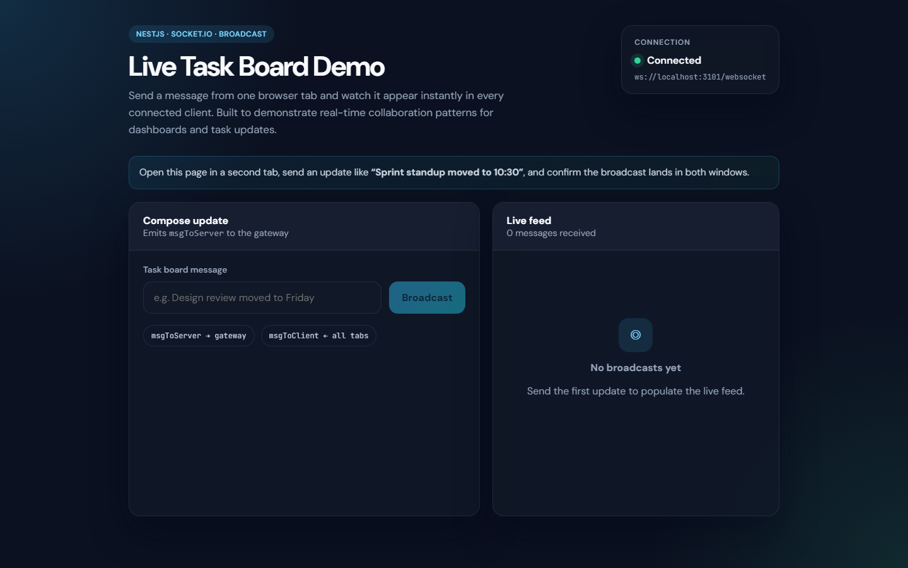
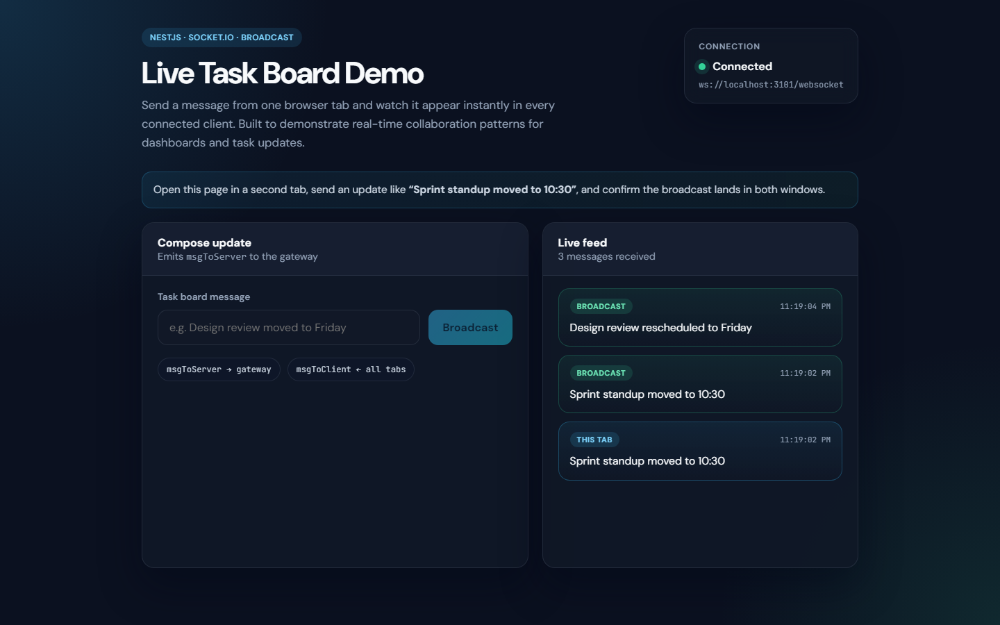

# Task Management — WebSocket Server

NestJS WebSocket gateway for real-time message broadcasting, built with Socket.io. Includes a static Vue demo page for testing live client ↔ server messaging.

> **Portfolio:** [ibrahimqumseya.github.io](https://ibrahimqumseya.github.io) · Related React task UI: [task-managment-front-end](https://github.com/IbrahimQumseya/task-managment-front-end)

## Problem Solved

Demonstrates how to build a **real-time server** in NestJS: connection lifecycle hooks, subscribed message handlers, and broadcast to all connected clients — a pattern used in live dashboards, chat, and collaborative task boards.

## Core Features

| Feature | Description |
| --- | --- |
| **WebSocket gateway** | NestJS `@WebSocketGateway` on port `3101` |
| **Socket.io** | Path `/websocket`, CORS enabled |
| **Connection lifecycle** | Logs connect / disconnect events |
| **Broadcast messaging** | `msgToServer` → broadcast `msgToClient` to all clients |
| **Static demo client** | Vue 1 page in `static/index.html` for manual testing |

## Stack

| Layer | Technology |
| --- | --- |
| **Framework** | NestJS 8 |
| **Real-time** | Socket.io 4, `@nestjs/websockets` |
| **Language** | TypeScript |
| **Demo UI** | Vue 1 (static HTML in `static/`) |

## Architecture

```
Client (browser)          NestJS Gateway              All clients
      │                         │                         │
      │── msgToServer ─────────▶│                         │
      │                         │── msgToClient (broadcast)▶│
```

Gateway implementation: `src/app.gateway.ts`

## Getting Started

### Prerequisites

- Node.js 16+
- npm

### Install & run

```bash
git clone https://github.com/IbrahimQumseya/task-management-web-socket.git
cd task-management-web-socket
npm install
npm run start:dev
```

Server listens on **http://localhost:3101** (WebSocket path: `/websocket`).

### Try the demo

1. Start the server (`npm run start:dev`)
2. Open `static/index.html` in a browser (or serve the `static/` folder)
3. Open a second browser tab/window to the same page
4. Send a message — it appears in **both** tabs via broadcast

### Scripts

| Script | Description |
| --- | --- |
| `npm run start:dev` | Development with watch |
| `npm run build` | Production build |
| `npm run test` | Unit tests |
| `npm run test:e2e` | E2E tests |

## WebSocket Events

| Event | Direction | Description |
| --- | --- | --- |
| `msgToServer` | Client → Server | Send text payload |
| `msgToClient` | Server → All clients | Broadcast received message |

## Related Project

**[task-managment-front-end](https://github.com/IbrahimQumseya/task-managment-front-end)** — React task management UI (Redux Toolkit, Material UI, auth). Separate REST-based app from the same learning period; not wired to this WebSocket server.

## Screenshots / Demo

| Screen | Preview |
| --- | --- |
| Static WebSocket demo |  |
| Two-tab broadcast |  |

## License

This project is licensed under the MIT License — see the [LICENSE](LICENSE) file for details.
